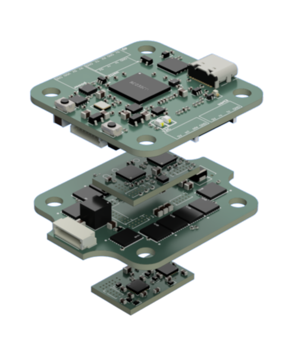
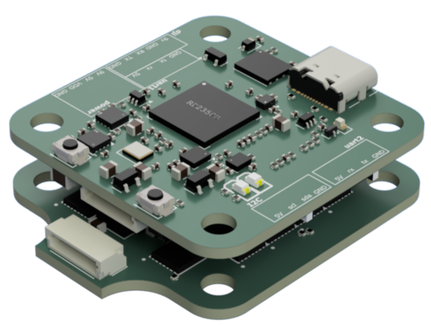

# RP2350 Flight controller stack 

This repo contains the design files for a rp2350 based flight controller stack, with an [am32](https://wiki.am32.ca/development/Hardware-Design.html) based 4-in-1 modulable esc.
The esc part is split onto 3 boards : 
- top and bottoma board with logic and mosfet drivers (logic)
- middle with mosfets and power converters (powerstage)

This design allows for repairability, if you want to change the power board for a higher current one or if you have burnt it, just swap it out and solder a new board ! 

I also wanted to experiment with the newly supported rp2350 mcu on betaflight ! Madflight has an esc but I haven't seen any on a 30.5x30.5 "classic" format yet.

Thhe flight controller is quite simple and only has support for the essential to fly digital fpv with : 
- uart for elrs/radio transceiver 
- uart for video like openipc or dji
- uart for gps (additionnal too!)
- one spare i2c port (because there was room for it :v)
- power (9v 3a max, 5v 3a max and 3v3 200ma max **only use if necessary**)

Additionally, there are also some betaflight rgb headers and buzzer. Since it is an rp2350 with PIO, it should be easy to repurpose the i2c port for something else. The pinout is also similar to the madflight fc3 but not exactly the same, in /src/firmware/betaflight/picoflight/config.h you will find the exact files needed to build a firmware along precompiled binary 

## Renders :
 

# BOM 
| Name     | Qty     | Price  | Link   | Note |
| -------- | ------- | ------ | ------ | ----- |
| Components | 1     | 110usd  | /src/bom_export_fc.xls |
| PCB      | 3x5pcs  | 5usd/ea | https://jlcpcb.com/ | order each board design individually to have discounts !|
| total         |         | 125usd |  |shipping included

# ZINEE !!
